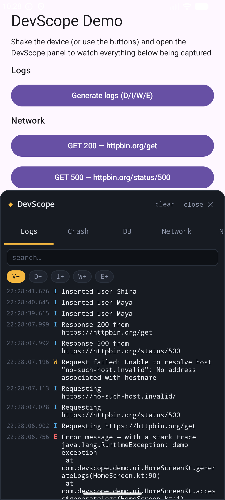
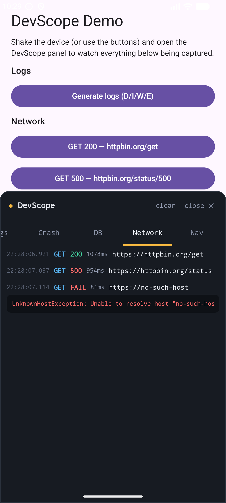
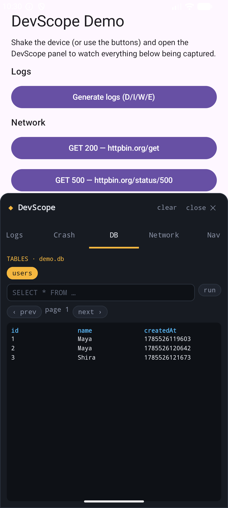
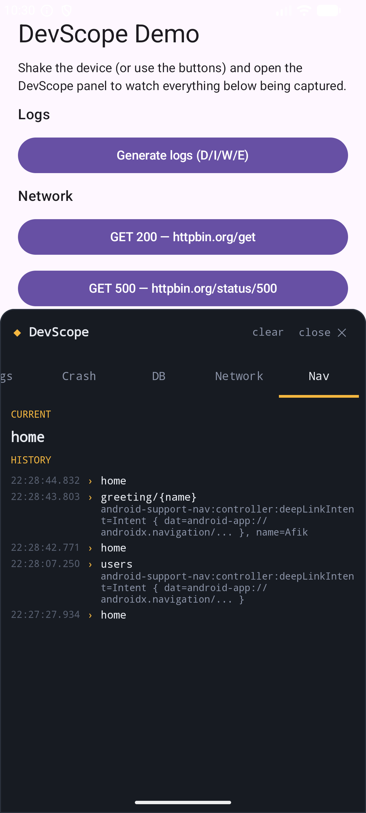
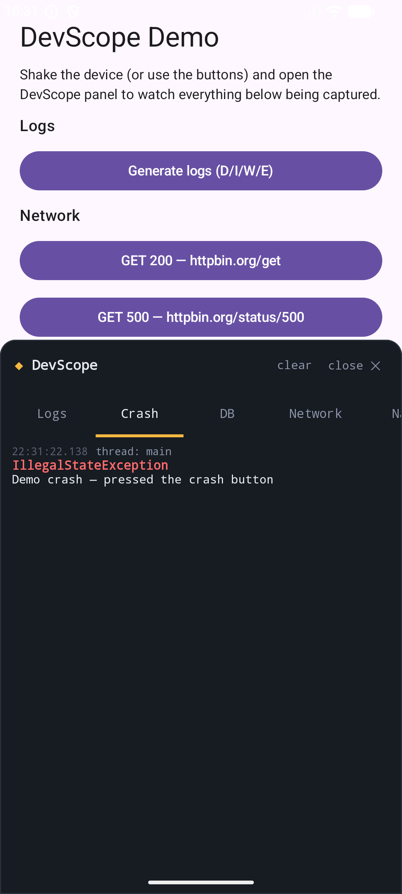
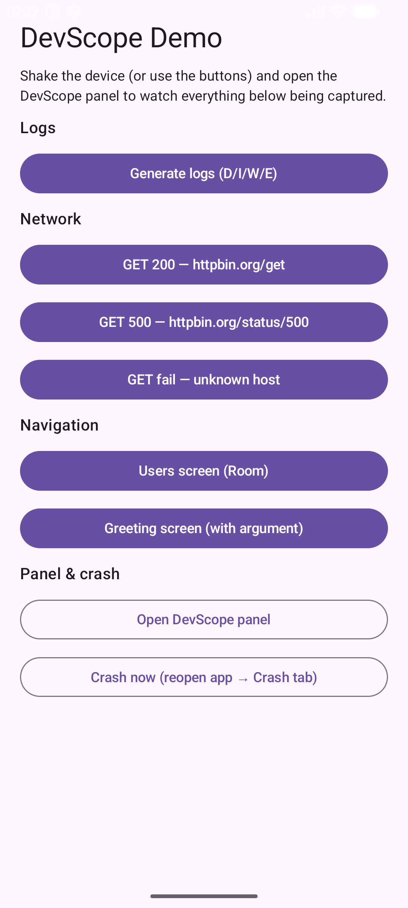

# ◆ DevScope

**A drop-in debug overlay for Android.** Add one line to your `Application`, shake the device, and get a floating panel with live logs, HTTP calls, navigation history, your Room database, and crash reports — on the device itself, no cable and no Logcat needed.

> Course project — Advanced Android Development. Built with Kotlin, Jetpack Compose, Room, Navigation Compose, OkHttp and Timber.

| Logs | Network | DB |
|---|---|---|
|  |  |  |

| Nav | Crash | Demo app |
|---|---|---|
|  |  |  |

## Why

Debugging on a real device is painful: Logcat lives on your computer, Room rows are invisible without another build, HTTP calls are a black box, and crashes on someone else's device vanish. DevScope puts all of that in a panel inside the app.

## Install

**Step 1 — add JitPack** to `settings.gradle.kts`:

```kotlin
dependencyResolutionManagement {
    repositories {
        google()
        mavenCentral()
        maven("https://jitpack.io")
    }
}
```

**Step 2 — add the dependency** (module `build.gradle.kts`):

```kotlin
dependencies {
    implementation("com.github.afiksoco:DevScope:1.0.0")
}
```

**Step 3 — install in your `Application`:**

```kotlin
class MyApp : Application() {
    override fun onCreate() {
        super.onCreate()

        DevScope.install(this)
            .trackDatabase(appDatabase)      // optional: Room tab
            .openOn(Trigger.SHAKE)           // or Trigger.BUBBLE / Trigger.MANUAL

        // optional: Network tab — add the interceptor when building your client
        val client = OkHttpClient.Builder()
            .addInterceptor(DevScope.networkInterceptor)
            .build()
    }
}
```

**Optional — Nav tab** (Navigation Compose):

```kotlin
val navController = rememberNavController()
DevScope.trackNavigation(navController)
```

That's it. Shake the device → the panel opens. In **release builds `install()` is a no-op**: zero UI, zero recording, zero overhead.

## The tabs

| Tab | What it shows | How it works |
|---|---|---|
| **Logs** | Live log stream with search + level filter | A capture-only `Timber.Tree` |
| **Network** | Every HTTP call: method, status, duration, body preview | `okhttp3.Interceptor` using `peekBody` (never consumes your response) |
| **Nav** | Current route + navigation history with arguments | `NavController.OnDestinationChangedListener` |
| **DB** | Browse Room tables page by page, run free SQL | `RoomDatabase.query` on a background thread |
| **Crash** | Crashes with full stack trace; share / delete | `Thread.setDefaultUncaughtExceptionHandler`, persisted to disk |

## Architecture

Every tab is a class implementing one interface:

```kotlin
interface DevScopeModule {
    val id: String
    val title: String
    @Composable fun Content()
    fun onClear() {}
}
```

- `ModuleRegistry` holds the modules and guards every callback — a module that throws is disabled (its tab shows *unavailable*) instead of crashing your app.
- `OverlayController` attaches a `ComposeView` to the current Activity's decor view. Deliberately **not** a `WindowManager` system overlay: no `SYSTEM_ALERT_WINDOW` permission, so there is nothing the user can deny.
- `RingBuffer` bounds every stream (2,000 log lines, 500 HTTP calls) so a long session can't OOM the host app.
- Panel state lives at Application scope — the panel survives rotation and follows you between Activities.
- OkHttp, Room and Navigation are **compileOnly** dependencies: an app that doesn't use them pays nothing and never loads those modules.

## Edge cases handled

| Edge case | Behavior |
|---|---|
| A DevScope module throws | Module disables itself, tab shows the reason, host app unaffected |
| Crash inside the crash handler | Report saving is try/caught; the original handler is **always** delegated to — no crash loop |
| Endless logs / huge sessions | Fixed-size ring buffers, oldest entries dropped |
| Huge / binary response bodies | Truncated at 250 KB; binary shown as size only |
| Screen rotation / process death | Panel state and buffers survive rotation; crash reports are written to disk before the process dies |
| No accelerometer (emulator) | `Trigger.SHAKE` falls back to the floating bubble |
| Destructive SQL in the DB tab | `DROP/DELETE/UPDATE/…` detected and requires explicit confirmation; all queries run off the main thread, paginated 50 rows |
| App without Room/OkHttp/Navigation | Those modules are simply never registered — no forced dependencies |
| `install()` called twice / in release | Safe no-op |

## Demo app

The `app` module is a small showcase: buttons that generate logs, fire successful/failing HTTP calls, a Room `users` screen, a navigation flow with arguments, and a crash button. Run it, shake, and watch every tab fill up.

```
./gradlew :app:installDebug
```

## Project structure

```
devscope/                      the library
  ├── DevScope.kt              public API (install / triggers / interceptor)
  ├── core/                    module contract, registry+fail-safe, ring buffer,
  │                            overlay controller, shake detector
  ├── log/  network/  nav/  db/  crash/    one package per module
  └── ui/                      Compose panel, tabs, theme
app/                           demo application
```

## Tests

```
./gradlew :devscope:test
```

Unit tests cover the pure logic: `RingBuffer` (ordering, capacity, thread-safety) and `SqlGuard` (destructive-SQL detection).

## License

MIT
